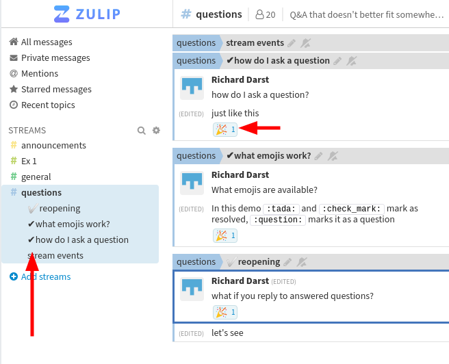

# Zulip forum bot

Someone was trying to use Zulip as a Q&A forum.  Threaded topics make
this possible, but there is still a problem with keeping things
organized.  Inspired by their workaround, this code will:

* When an emoji reaction (such as `check_mark`) is given, it will
  rename the topic of that thread to include the emoji.  Thus, it is
  easy to mark topics as resolved, in progress, etc.

* If your audience doesn't understand threads and comments in existing
  threads, that's annoying.  You can always rename, or you con comment
  with the `scissors` emoji and it will cut it for you.  You still
  need to rename the topic yourself, but this seems to be less
  annoying mouse strokes.




## Installation and invocation

This is currently alpha-quality but it works for its purpose.  If this
is useful comment and it can be improved.

Currently no installation, clone the repository, create a bot, add a
bot to the streams, download your bot's
zuliprc file from the Zulip server, add configuration to the zuliprc
file (see below), and run `zulip-forum-bot.py {zuliprc-file}`.
**Don't forget to add your bot to the streams, this has to be done by
yourself on the Zulip side.**


## Configuration

Currently configuration is via the same `zuliprc` file that is used to
access the API, in a `[forum]` section.  As an example:

```
[api]
email=...@zulip.your.domain
key=abcdefghijklmopqrstuvwxyz
site=https://yourrealm.zulip.your.domain
[forum]
users=user3498@zulip.your.domain, userXXXX@zulip.your.domain
streams=forum
emojis=check_mark, question
```

* `streams`: it will only operate on messages in these streams
  (default: `*` which is all streams, of course limited to the streams
  the bot is subscribed to).
* `users`: it will only operate when these users make the reaction.
  Users go by email, but note that if emails are not visible, you
  *must* use the internal Zulip email. (You can find this email in the
  organization user list).  Users are looked up by email only
  when the bot is first started, so please restart the bot when you
  have users listed who are not yet registered.  (default: all users)
* `emojis`: it will only operate on these reaction emojis.  Use `*`
  for all.  `scissors` is treated specially and cuts the thread.
  (default: `check_mark`, `question`, `scissors`).
* Unfortunately the user groups API does not accept bot requests.

Hardcoded default config:

* `tada` becomes `check_mark` in the topic.
* Replying to a topic that starts with `check_mark` will transform it
  to `white_check_mark` to indicate it has been replied to.  Set the
  config value `edits_reopen` to anything other than `true` to disable
  this.


## Future development ideas

* Eliminate the need to restart to update the list of allowed users.
* Control commands by private message
* Control or configuration from within the server somehow.  Could use
  `client.get_storage`, `client.update_storage`, etc. to persist the
  configuration.

## Development status and maintenance

This is proof of concept but works.  If you find it useful, get in
touch and we can improve it some.
